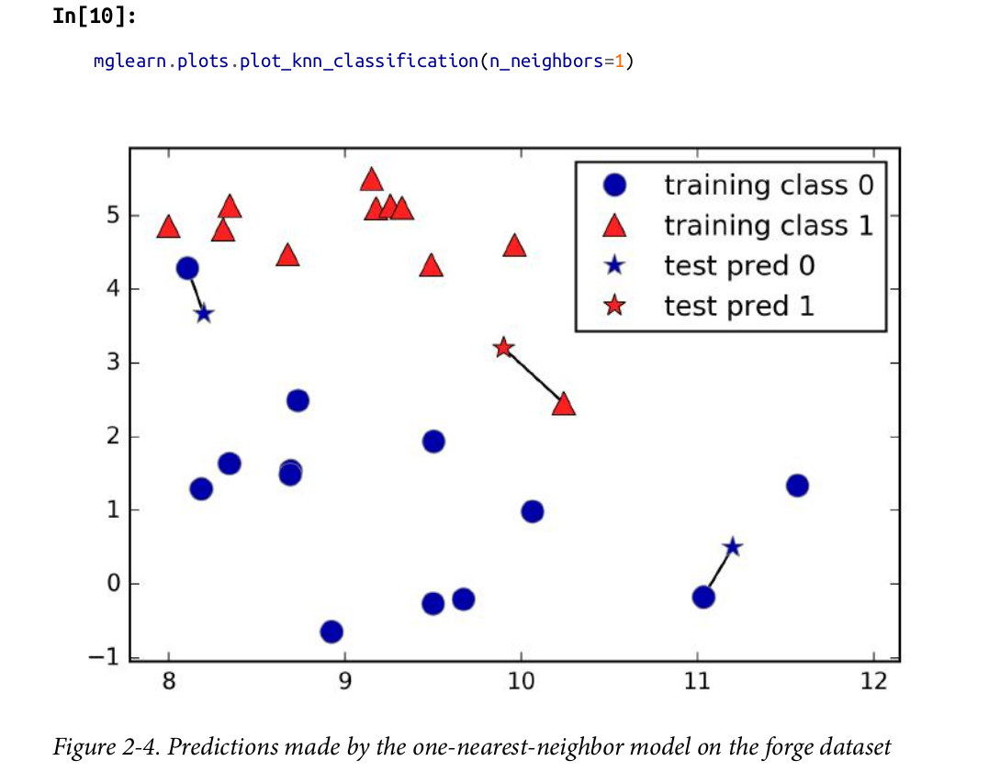

## Superviced learning

Supervied learning is used whenever we want to predict a certain outcome from a given input, and we have examples of input/output pairs.

## Generalization, Overfitting, and Underfitting

- `Genralization` - In supervised learning, we want to build a model on the training data and then be able to make accurate predictions on new, **unseen data that has the same characteristics as the training set that we used.** If a model is able to make accurate predictions on unseen data, we say it is able to generalize from the training set to the test set.

- `Overfitting` - Overfitting occurs when you fit a model too closely to the particularities of the training set and obtain a model that works well on the training set but is not able to generalize to new data. (focing so much on individuallity of data from training dataset, it will do will with test dataset but focuing too much particularities in trainging dataset could cause unreal prdication with new unknow dataset.)

- `Underfitting` - If your model is too simple then you might not be able to capture all the aspects of and variability in the data, and your model will do badly even on the training set. Choosing too simple a model is called underfitting.

> The more complex we allow our model to be, the better we will be able to predict on the training data. However, if our model becomes too complex, we start focusing too much on each individual data point in our training set, and the model will not generalize well to new data.

> There is a sweet spot in between that will yield the best generalization performance. This is the model we want to find.

## Relation of Model Complexity to Dataset Size

The larger variety of data points your data‐set contains, the more complex a model you can use without overfitting. Usually, collecting more data points will yield more variety, so larger datasets allow building more complex models. However, simply duplicating the same data points or collecting very similar data will not help.

## Supervised Machine Learning Algorithms

### k-Nearest Neighbors

the k-NN algorithm only considers exactly one nearest neighbor, which is the closest training data point to the point we want to make a prediction for. The prediction is then simply the known output for this training point

Instead of considering only the closest neighbor, we can also consider an arbitrary number, k, of neighbors. This means that for each test point, we count how many neighbors belong to class 0 and how many neighbors belong to class 1. We then assign the class that is more frequent: in other words, the majority class among the k-nearest neighbors.

